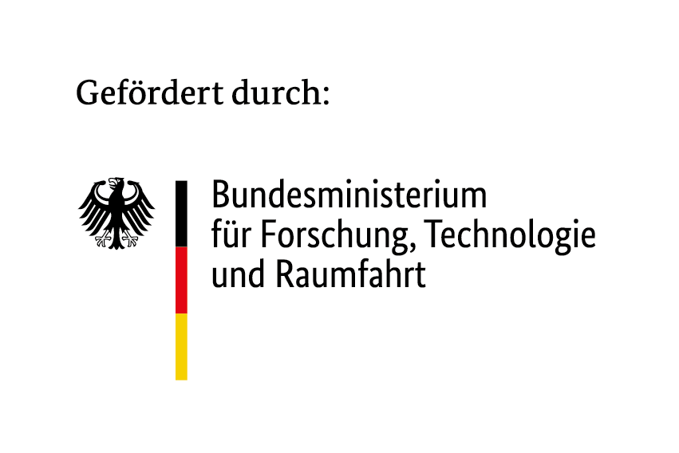

<div style="background-color: #ffffff; color: #000000; padding: 10px;">

<h1>Workshop: Agentic RAG</h1>
</div>

Build an agentic Retrieval-Augmented Generation (RAG) system using LLM tool-calling, Qdrant vector search, and Chainlit.

## Architecture

```
workshop-agentic-rag/
  app/            # Chainlit chat app with RAG agent + per-user KB uploads
  k8s/            # Kubernetes deployment manifests
  Dockerfile      # Chat app image
  system.md       # System prompt for the RAG agent
```

### Components

| Service | Description | Port |
|---------|-------------|------|
| **app** | Chainlit chat interface with LLM agent, per-user KB uploads, and Qdrant RAG tool | 8000 |
| **Qdrant** | Vector database for document embeddings | 6333 |
| **PostgreSQL** | Chat thread persistence & authentication | 5432 |
| **LiteLLM** | LLM proxy for chat and embedding models | 4000 |

## Quick Start

### Prerequisites

- Docker and Docker Compose
- Access to a LiteLLM proxy (or OpenAI-compatible API)

### 1. Configure

```bash
cp app/.env.example app/.env
# Edit app/.env with your LiteLLM endpoint and API key
```

### 2. Start services

```bash
cd app
docker compose up -d
```

This starts the chat app, PostgreSQL, and Qdrant.

### 3. Ingest documents

**Per-user uploads**: Log in to the chat UI and use the settings modal to
create a KB and upload PDFs. Documents are persisted by `document_id` and
citations link straight to the PDF sidebar viewer.

**Bulk ingest** (shared corpus): Use the CLI script in `app/`.

```bash
cd app
python ingest_docling.py --docling-json-dir /path/to/json/exports
```

### 4. Chat

Open http://localhost:8000 and start asking questions.

## Kubernetes Deployment

See [k8s/](k8s/) for deployment manifests.

## License

See [LICENSE](LICENSE).

---

## Acknowledgements


The [AI Service Centre Berlin Brandenburg](http://hpi.de/kisz) is funded by the [Federal Ministry of Research, Technology and Space](https://www.bmbf.de/) under the funding code 16IS22092.
